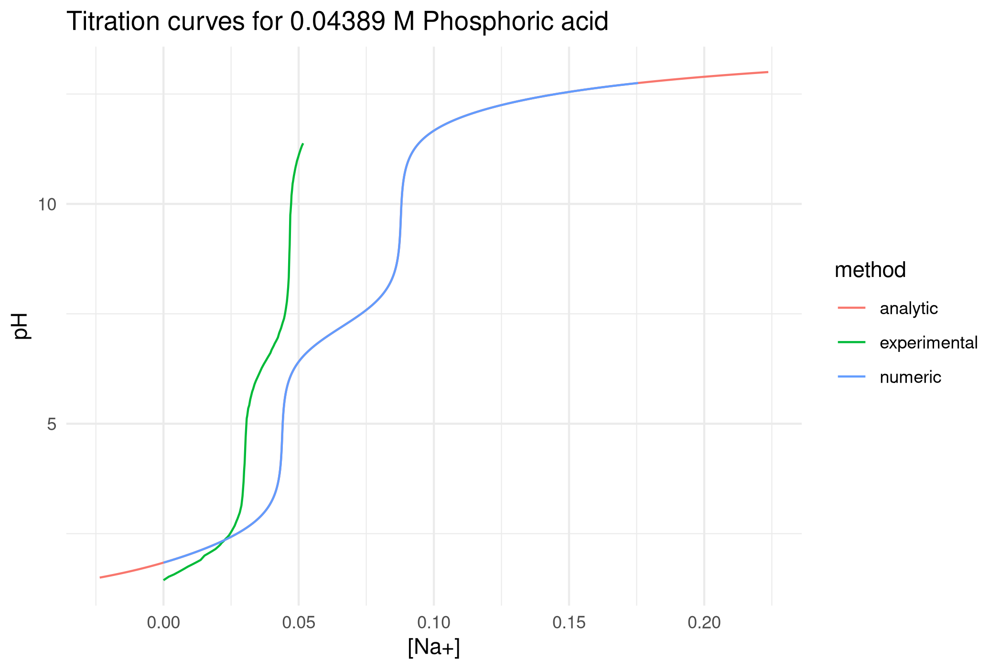

# Numerical method
 
`R/phosphoric_titration_numeric.R` was run with R version 4.0.4, and `nleqslv` version 3.3.2.

Thanks to Bhas for helping with that at stackoverflow: https://stackoverflow.com/a/66883518/11524079

The result is saved for convenience and reference in the `output/result.df.RDS` file.

# Analytical method

`R/phosphoric_titration_analytic.R` will tun the analytical method explained by Poutnik at chem.se: https://chemistry.stackexchange.com/a/149285/107836

# Experimental data

Code for comparison to experimental data (from Julia Martín _et al_, DOI 10.20431/2349-0403.0409002) is at `R/comparison.R`.

Well, its something!

