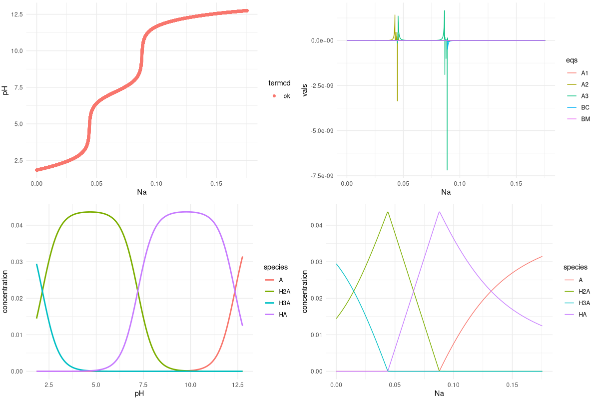
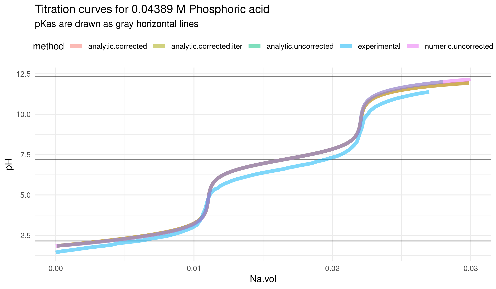

> 3.5 methods for simulating phosphoric acid titration curves.
> 
> The output of all methods is combined in the `R/comparison.R` script.

# 1. Numerical method

It solves the acid-base equations for a given Na concentration, in a phosphoric acid buffer.
 
`R/phosphoric_titration_numeric.R` implements the numerical method, and was run with R version 4.0.4, and `nleqslv` version 3.3.2.

Thanks to Bhas for helping with that at stackoverflow: https://stackoverflow.com/a/66883518/11524079

The result is saved for convenience and reference in the `output/result.df.RDS` file (and others, similarly named).

Everything relevant in a plot :)

> Titration curve (top left); values of objective functions (top right, BM: mass balance, BC: charge balance, An: acid-base equilibria); speciation diagram (bottom left) and a nice _Na VS species_ plot which I never saw in class (bottom right).

# 2. Analytical method

`R/phosphoric_titration_analytic.R` implements the analytical method explained by Poutnik at: https://chemistry.stackexchange.com/a/149285/107836

Very simple and elegant: solving for Na is _much_ simpler than solving for pH.

It took me 10 minutes to implement Poutnik's solution (while learning how to use numerical solvers took me days).

> Moraleja: KISS :P

## 2.5 Volume corrections

Implementation of a way of adjusting for titrant volume addition, in the `R/phosphoric_titration_analytic.vol_correct.R` script. Complements Poutnik's answer.

First, the script solves for `[Na+]` without corrections. Then uses it to update total volume and acid concentrarion. This calculation is repeated until convergence (see `Na.adj.one()`; tol = `1e-8`).

- [x] I still have to check if it really converges to where it's supposed to. Poutnik suggested other methods.
- [ ] I still have to find out _why_ it converges xD.

I also solved the corrected version analitically, and it matches perfectly (see `Na.adj.analitico()` and the plots below).

# 3 Experimental data

Code for comparison to experimental data (from Julia Martín _et al_, DOI 10.20431/2349-0403.0409002) is at `R/comparison.R`.

> Note: the "iterative" volume correction to the volume-uncorrected analytical solution has some trouble converging in the conditions of the real experiment. But works in test conditions or with more iterations.
> 
> The volume-corrected analytical solution also struggles in these conditions, and the top pH had to be set below 12.

Well, its something!

